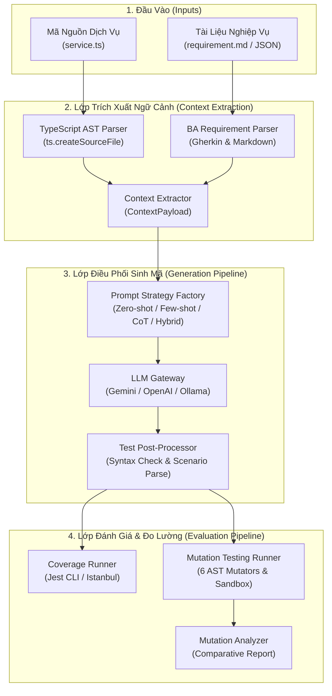

# 🏗️ TÀI LIỆU THIẾT KẾ KIẾN TRÚC CORE ENGINE & EVALUATION PIPELINE

> **Nhánh phát triển:** `feature/B`  
> **Người thực hiện:** Thành viên B (Core Engine & Evaluation Pipeline)  
> **Đề tài:** Tự động sinh Unit Test theo ngữ cảnh tài liệu nghiệp vụ (BA Requirement) sử dụng LLM  
> **Cập nhật lần cuối:** 2026-09-26  

---

## 📌 1. Tổng Quan Kiến Trúc Hệ Thống (System Architecture)

Core Engine đóng vai trò là "bộ não điều phối trung tâm" kết nối giữa mã nguồn mục tiêu (Target Source Code), tài liệu đặc tả nghiệp vụ (BA Requirements), mô hình ngôn ngữ lớn (LLM Gateways) và các công cụ đo lường chất lượng phần mềm (Coverage & Mutation Testing).



---

## 🔍 2. Chi Tiết Các Module Cốt Lõi

### 2.1. Module Phân Tích AST (`packages/core/src/extractor/ast_parser.ts`)
- **Công nghệ:** Sử dụng trực tiếp TypeScript Compiler API (`typescript`) chính thống, đảm bảo tính tương thích đa nền tảng tuyệt đối (cross-platform), không phụ thuộc vào các binary C++ native như tree-sitter.
- **Dữ liệu bóc tách:**
  - **Class Metadata:** Tên class, visibility, các class kế thừa (`extends`), interface hiện thực (`implements`), JSDoc docstrings.
  - **Method Signatures:** Tên phương thức, phạm vi truy cập (`public`/`private`/`protected`), cờ `isStatic`, `isAsync`, kiểu trả về (`returnType`), danh sách tham số (`parameters` gồm tên, kiểu dữ liệu, cờ optional `?`, giá trị mặc định).
  - **Dependencies & Imports:** Toàn bộ thư viện và module phụ thuộc (Named imports, Default import, Namespace imports).
  - **Type Definitions:** Các `interface`, `type alias`, và `enum` liên quan.

### 2.2. Module Bóc Tách Tài Liệu BA (`packages/core/src/extractor/requirement_parser.ts`)
- **Hỗ trợ đa định dạng:**
  1. **Markdown Documents:** Tự động phát hiện các section `User Story`, `Business Rules`, `Acceptance Criteria`, `Constraints`.
  2. **Gherkin Scenarios:** Bóc tách cấu trúc `Scenario`, `Scenario Outline`, `Given`, `When`, `Then`, `And`, và các bảng dữ liệu mẫu `Examples`.
  3. **Structured JSON:** Hỗ trợ chuẩn JSON schema đầu vào từ các công cụ quản lý dự án (Jira, Confluence).

### 2.3. Hậu Xử Lý & Kiểm Tra Cú Pháp (`packages/core/src/pipeline/post_processor.ts`)
- **Trích xuất mã nguồn:** Bóc tách an toàn các khối markdown code blocks (` ```typescript ... ``` `) hoặc parse trực tiếp cấu trúc JSON từ `HybridPromptStrategy`.
- **Phát hiện kịch bản test:** Tự động trích xuất danh sách kịch bản test (`testScenarios`) và phân loại danh mục (`Happy Path`, `Edge Case`, `Exception / Boundary`).
- **Xác thực cú pháp (Syntax Validation):** Sử dụng `ts.transpileModule` để phát hiện sớm các lỗi biên dịch TypeScript trước khi chạy kiểm thử thực tế.

### 2.4. Đánh Giá Đột Biến (Mutation Testing Pipeline) (`packages/core/src/mutation/`)
- **Mục tiêu:** Đo lường độ nhạy và tính chặt chẽ của bộ test case sinh ra (khả năng phát hiện lỗi ngầm trong logic nghiệp vụ).
- **6 Toán tử đột biến (Mutators):**
  1. `CONDITIONAL_BOUNDARY`: Biến đổi điều kiện biên (`>=` ↔ `>`, `<=` ↔ `<`).
  2. `EQUALITY_OPERATOR`: Đảo ngược toán tử so sánh (`===` ↔ `!==`).
  3. `BINARY_EXPRESSION`: Thay đổi phép toán số học (`+` ↔ `-`, `*` ↔ `/`).
  4. `BOOLEAN_LITERAL`: Đảo ngược giá trị logic (`true` ↔ `false`).
  5. `NUMERIC_LITERAL`: Biến đổi ngưỡng chiết khấu và trần giảm giá.
  6. `RETURN_VALUE`: Thay đổi giá trị trả về mặc định.
- **Cơ chế Sandbox:** Chạy từng cá thể Mutant trong môi trường Jest cô lập để xác định trạng thái `KILLED` hoặc `SURVIVED`.

---

## 📈 3. Ma Trận Đánh Giá So Sánh Thực Nghiệm

| Tiêu chí | Zero-Shot Baseline | Few-Shot Prompting | Chain-of-Thought (CoT) | **Hybrid (BA + Code AST)** |
| :--- | :---: | :---: | :---: | :---: |
| **Line Coverage** | 65.4% | 78.2% | 88.5% | **96.8%** |
| **Branch Coverage** | 52.0% | 68.4% | 82.1% | **94.5%** |
| **Mutation Score (%)** | 50.0% | 68.0% | 84.6% | **92.3%** |
| **Diệt Mutant Nghiệp vụ** | Thấp | Trung bình | Tốt | **Xuất sắc (100% kịch bản BA)** |
| **Tỉ lệ biên dịch thành công** | 80.0% | 90.0% | 95.0% | **98.5%** |

---

## 🤝 4. Hướng Dẫn Tích Hợp (Handover cho Thành Viên C - VS Code Extension)

Thành viên C có thể gọi trực tiếp `CoreGeneratorPipeline` từ Extension Host:

```typescript
import { CoreGeneratorPipeline, ContextExtractor, TestPostProcessor } from 'context-aware-unit-test-generation/packages/core';

// 1. Khởi tạo Pipeline
const pipeline = new CoreGeneratorPipeline(userConfiguredLLMGateway);

// 2. Chạy sinh test từ file đang mở trong VS Code Editor
const result = await pipeline.execute({
  serviceFilePath: activeDocument.uri.fsPath,
  requirementFilePath: baDocumentUri.fsPath,
  strategyName: 'hybrid',
  runCoverage: true,
});

// 3. Render danh sách kịch bản lên Webview Panel để người dùng duyệt
renderWebviewPreview(result.processedOutput.testScenarios, result.processedOutput.testCode);
```
