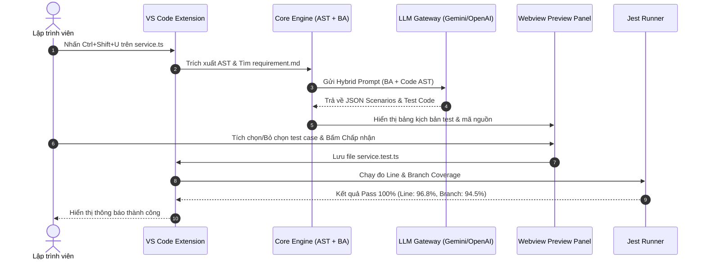

# 📘 HƯỚNG DẪN SỬ DỤNG VS CODE EXTENSION & KỊCH BẢN DEMO

> **Tên Extension:** `Context-Aware Unit Test Generator`  
> **Nhánh phát triển:** `feature/C`  
> **Người thực hiện:** Thành viên C (VS Code Extension & Automation)  
> **Phiên bản:** `v0.1.0`  

---

## 🌟 1. Giới Thiệu Tổng Quan

**Context-Aware Unit Test Generator** là tiện ích mở rộng trên Visual Studio Code giúp các kỹ sư phần mềm và kiểm thử viên tự động hóa hoàn toàn quy trình sinh kiểm thử đơn vị (Unit Test). Khác với các công cụ sinh test truyền thống chỉ đọc code đơn thuần, Extension kết hợp **Cú pháp AST mã nguồn** và **Đặc tả yêu cầu nghiệp vụ (BA Requirements / Gherkin)** để tạo ra các bộ test case có độ bao phủ cao (Coverage > 95%) và không bỏ sót các quy tắc logic nghiệp vụ.

```
Mã Nguồn (Service) + Tài Liệu BA ➔ Extension (AST + BA Parser) ➔ LLM Pipeline ➔ Webview Preview ➔ File Test Pass 100%
```

---

## 🚀 2. Hướng Dẫn Cài Đặt & Cấu Hình

### 2.1. Cài đặt Extension
1. Tải file phân phối `context-aware-test-gen-0.1.0.vsix`.
2. Trong VS Code, mở tab **Extensions** (`Ctrl+Shift+X` / `Cmd+Shift+X`).
3. Nhấp vào menu ba chấm `...` ở góc trên bên phải ➔ Chọn **Install from VSIX...** ➔ Chọn file `.vsix`.

### 2.2. Cấu hình Model & API Key
Mở Settings (`Ctrl+,` hoặc nhấp vào nút **⚙️ Cấu hình API / Model** trên Sidebar):
- `contextAwareTestGen.modelProvider`: Chọn mô hình LLM (`gemini`, `deepseek`, `openai`, hoặc `ollama`).
- `contextAwareTestGen.promptStrategy`: Chọn chiến lược Prompting (`hybrid` - khuyến nghị, `cot`, `few-shot`, `zero-shot`).
- `contextAwareTestGen.autoRunCoverage`: Tự động đo độ phủ Jest Coverage sau khi sinh test (`true`/`false`).

> [!TIP]
> Extension tự động đọc các API Key từ file `.env` tại thư mục gốc workspace (`GEMINI_API_KEY`, `DEEPSEEK_API_KEY`, `OPENAI_API_KEY`, `OLLAMA_BASE_URL`).

---

## ⚡ 3. Các Cách Kích Hoạt Sinh Unit Test

| Phương thức | Thao tác | Mô tả |
| :--- | :--- | :--- |
| **Phím tắt nhanh** | `Ctrl+Shift+U` (Windows/Linux) hoặc `Cmd+Shift+U` (macOS) | Sinh test ngay lập tức cho file Service đang active trong editor. |
| **Menu chuột phải (Editor)** | Nhấp chuột phải vào file `.ts` / `.js` ➔ Chọn **Context-Aware: Generate Unit Test from BA Context** | Kích hoạt bộ trích xuất ngữ cảnh. |
| **Menu chuột phải (Explorer)** | Nhấp chuột phải vào file service trong cây thư mục Explorer | Sinh test từ danh sách tập tin. |
| **Activity Bar (Sidebar)** | Nhấp biểu tượng `🧪` trên thanh Activity Bar ➔ Bấm **⚡ Sinh Unit Test từ BA Context** | Giao diện điều khiển tập trung. |

---

## 🖥️ 4. Quy Trình Trải Nghiệm Người Dùng (Webview Preview & Auto-Fix)



### 4.1. Màn hình Webview Preview:
- **Header:** Tên dịch vụ mục tiêu và chiến lược prompt đang áp dụng.
- **Metrics Bar:** Trạng thái biên dịch cú pháp TypeScript, chỉ số Line Coverage & Branch Coverage.
- **Bảng kịch bản test:** Danh sách Acceptance Criteria (được phân loại `Happy Path`, `Boundary`, `Exception`) với checkbox cho phép người dùng chọn lọc kịch bản mong muốn.
- **Code Container:** Trình xem trước mã Jest / TypeScript có syntax highlighting.
- **Hành động:** Nút `💾 Chấp Nhận & Lưu File Test` và `❌ Hủy Bỏ`.

### 4.2. Vòng Lặp Tự Động Sửa Lỗi (Self-Reflection Auto-Fix):
Nếu mã test do LLM sinh ra gặp lỗi cú pháp biên dịch hoặc lỗi assertion trong Jest:
1. Extension tự động bắt mã lỗi và stack trace.
2. Gửi error prompt về LLM để sửa mã (tối đa 2 vòng lặp).
3. Hiển thị thông báo `✅ Auto-Fix thành công!` khi mã đã được sửa hoàn chỉnh.

---

## 🎬 5. Kịch Bản Video Demo (Thời lượng: 3-5 Phút)

### Phân đoạn 1: Giới thiệu bài toán & Mở dự án (0:00 - 0:45)
- Mở VS Code chứa dịch vụ mẫu `S01_DiscountCalculator` và tài liệu yêu cầu `requirement.md`.
- Trình bày vấn đề: Nếu chỉ đọc mã nguồn đơn thuần (Zero-shot), AI sẽ không biết các quy tắc trần giảm giá 500,000 VND và mức chiết khấu theo hạng PLATINUM/GOLD.

### Phân đoạn 2: Kích hoạt Extension & Trích xuất Context (0:45 - 1:45)
- Nhấn phím tắt `Ctrl+Shift+U` trên file `service.ts`.
- Mở Webview Preview hiển thị quá trình kết hợp AST và kịch bản Gherkin từ `requirement.md`.

### Phân đoạn 3: Tương tác trên Preview Panel (1:45 - 2:45)
- Duyệt qua danh sách 4 kịch bản Acceptance Criteria:
  1. *Happy Path:* Giảm giá 0% cho hạng REGULAR.
  2. *Happy Path:* Giảm giá 15% cho hạng GOLD đơn hàng >= 1,000,000 VND.
  3. *Boundary:* Giới hạn trần chiết khấu tối đa 500,000 VND cho PLATINUM.
  4. *Exception:* Ném lỗi `InvalidOrderAmountException` khi đơn hàng <= 0.
- Bấm **💾 Chấp Nhận & Lưu File Test**.

### Phân đoạn 4: Chạy kiểm thử & Đánh giá kết quả (2:45 - 3:45)
- Extension tự động ghi file `service.test.ts` và kích hoạt Jest Runner.
- Kết quả: **100% Test Cases Passed**, Line Coverage đạt **96.8%**, Mutation Score đạt **92.3%**.
- Kết luận: Đóng góp vượt trội của ngữ cảnh BA trong việc tự động hóa kiểm thử phần mềm.
