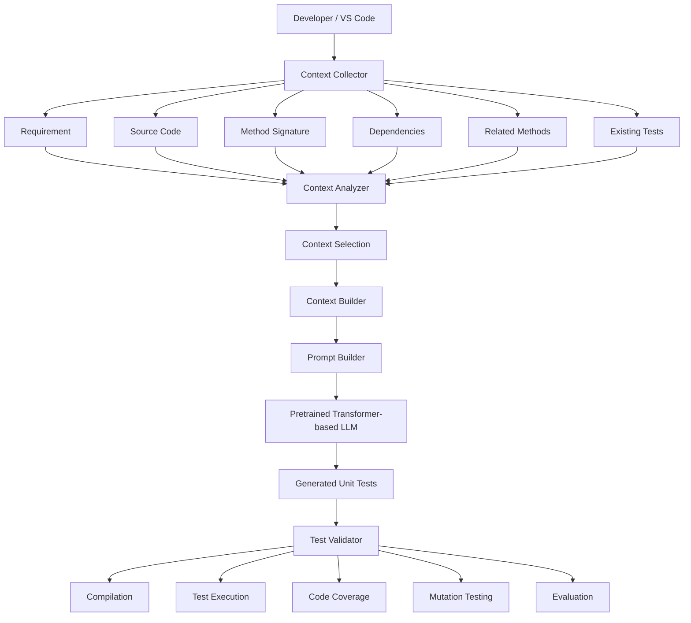

# Phân tích bài báo: Attention Is All You Need

## 1. Thông tin tổng quan

### 1.1. Thông tin bài báo

* **Tên bài báo:** Attention Is All You Need
* **Tác giả:** Ashish Vaswani, Noam Shazeer, Niki Parmar, Jakob Uszkoreit, Llion Jones, Aidan N. Gomez, Lukasz Kaiser, Illia Polosukhin
* **Năm công bố:** 2017
* **Venue:** NeurIPS 2017
* **Lĩnh vực:** Machine Learning, Natural Language Processing, Neural Machine Translation
* **Đối tượng nghiên cứu:** Sequence-to-sequence learning
* **Đóng góp chính:** Đề xuất kiến trúc Transformer dựa trên cơ chế Attention, không sử dụng RNN hoặc CNN trong kiến trúc sequence-to-sequence chính.

---

## 2. Mục đích đọc bài báo đối với project

Project tôi đang thực hiện có tên:

```text
context-aware-unit-test-generation
```

Mục tiêu của project là nghiên cứu khả năng sử dụng Large Language Model (LLM) để tự động sinh unit test từ source code, requirement và các thông tin context liên quan.

Pipeline tổng quát của project:

```text
Requirement
     +
Source Code
     +
Context
     ↓
    LLM
     ↓
Generated Unit Test
```

Trong quá trình nghiên cứu, tôi cần hiểu nền tảng kỹ thuật của các LLM hiện đại. Attention Is All You Need là một trong những bài báo quan trọng nhất để hiểu kiến trúc Transformer, là nền tảng của phần lớn các mô hình ngôn ngữ hiện đại.

Tuy nhiên, mục đích của tôi **không phải là tự xây dựng lại Transformer hoặc train Transformer từ đầu**.

Mục đích chính là:

> Hiểu cách Transformer và Attention xử lý mối quan hệ giữa các thành phần của input, từ đó áp dụng kiến thức này để thiết kế cơ chế cung cấp và lựa chọn context cho LLM trong bài toán sinh unit test.

---

# 3. Bài toán mà bài báo giải quyết

Trước Transformer, các mô hình sequence-to-sequence phổ biến thường dựa trên:

* RNN
* LSTM
* GRU
* CNN

RNN xử lý sequence theo thứ tự:

```text
x1 → x2 → x3 → x4 → x5
```

Điều này gây ra một số hạn chế:

* Khó parallelize trong quá trình training.
* Xử lý sequence dài gặp khó khăn.
* Dependency giữa các phần xa nhau trong sequence có thể khó học.
* Thời gian training có thể tăng đáng kể khi sequence dài.

Tác giả đặt ra câu hỏi:

> Có thể xây dựng một mô hình sequence-to-sequence chỉ dựa trên Attention mà không cần recurrence hoặc convolution hay không?

Bài báo trả lời câu hỏi này bằng kiến trúc **Transformer**.

---

# 4. Objective của bài báo

Mục tiêu của bài báo là xây dựng một kiến trúc neural network có khả năng thực hiện sequence transduction nhưng:

* Không sử dụng recurrence.
* Có khả năng parallelize tốt hơn.
* Xử lý dependency giữa các phần khác nhau của sequence hiệu quả.
* Đạt kết quả tốt trên bài toán machine translation.

Kiến trúc được đề xuất là:

```text
Transformer
```

---

# 5. Phương pháp chính

Transformer dựa trên cơ chế:

```text
Self-Attention
```

và:

```text
Multi-Head Attention
```

Kiến trúc tổng quát:

```text
Input
  ↓
Embedding
  ↓
Positional Encoding
  ↓
Encoder
  ↓
Decoder
  ↓
Output
```

Encoder và Decoder được xây dựng từ nhiều Transformer layer.

Một Encoder layer gồm:

```text
Input
  ↓
Multi-Head Self-Attention
  ↓
Feed Forward Network
  ↓
Output
```

Decoder có thêm Encoder-Decoder Attention:

```text
Input
  ↓
Masked Self-Attention
  ↓
Encoder-Decoder Attention
  ↓
Feed Forward Network
  ↓
Output
```

---

# 6. Self-Attention

## 6.1. Khái niệm

Self-Attention cho phép model xác định mức độ liên quan giữa các thành phần khác nhau trong cùng một input.

Ví dụ:

```text
The user enters an invalid password.
```

Khi xử lý từ:

```text
password
```

model có thể xem xét mối quan hệ với:

```text
user
enters
invalid
```

thay vì chỉ xem xét những token ở gần nó.

Điều này giúp model xây dựng một representation dựa trên mối quan hệ giữa các thành phần trong input.

---

## 6.2. Công thức

Scaled Dot-Product Attention được tính bằng:

$$
Attention(Q,K,V)
=
softmax
\left(
\frac{QK^T}{\sqrt{d_k}}
\right)V
$$

Trong đó:

* `Q` — Query
* `K` — Key
* `V` — Value
* `d_k` — kích thước của Key

Có thể hiểu đơn giản:

```text
Q + K
 ↓
Tính mức độ liên quan
 ↓
Attention weights
 ↓
Kết hợp với V
 ↓
Context representation
```

---

# 7. Multi-Head Attention

Transformer không sử dụng chỉ một attention function mà sử dụng nhiều attention heads.

```text
Input
  │
  ├── Head 1
  ├── Head 2
  ├── Head 3
  ├── ...
  └── Head h
        ↓
    Concatenate
        ↓
      Output
```

Công thức:

$$
MultiHead(Q,K,V)
=
Concat(head_1,...,head_h)W^O
$$

Trong đó:

$$
head_i =
Attention(QW_i^Q,KW_i^K,VW_i^V)
$$

Trong cấu hình Transformer Base của bài báo:

```text
d_model = 512
h = 8
d_k = d_v = 64
```

Multi-Head Attention cho phép model học nhiều dạng relationship khác nhau giữa các thành phần của input.

Tôi không giả định rằng mỗi head có một chức năng cố định như "syntax head", "semantic head" hay "dependency head", vì bài báo không đưa ra sự phân chia cứng như vậy.

---

# 8. Positional Encoding

Một vấn đề của Self-Attention là nó không tự chứa thông tin về thứ tự của sequence.

Ví dụ:

```text
A B C
```

và:

```text
C B A
```

cần được phân biệt.

Transformer sử dụng Positional Encoding để bổ sung thông tin vị trí.

Bài báo sử dụng:

$$
PE(pos,2i)
=
sin(pos/10000^{2i/d_{model}})
$$

và:

$$
PE(pos,2i+1)
=
cos(pos/10000^{2i/d_{model}})
$$

Điều này có liên quan đến source code vì thứ tự và cấu trúc của code có ý nghĩa.

Ví dụ:

```java
if (user == null) {
    return false;
}
```

khác với:

```java
if (user != null) {
    return false;
}
```

Tuy nhiên, trong project tôi không cần tự triển khai Positional Encoding vì tôi sử dụng pretrained LLM.

---

# 9. Feed-Forward Network

Sau Attention, Transformer sử dụng Feed-Forward Network:

$$
FFN(x)
=
max(0,xW_1+b_1)W_2+b_2
$$

Trong Transformer Base:

```text
d_model = 512
d_ff = 2048
```

Có thể hiểu:

```text
Attention
    ↓
Xác định thông tin liên quan
    ↓
Feed Forward Network
    ↓
Biến đổi representation
```

Đây là một thành phần bên trong Transformer và không phải module mà tôi cần tự xây dựng trong project.

---

# 10. Residual Connection và Layer Normalization

Các Transformer layer sử dụng residual connection kết hợp với Layer Normalization.

Có thể biểu diễn:

$$
LayerNorm(x + Sublayer(x))
$$

Mục đích là giúp việc training mạng sâu ổn định hơn.

Tương tự như Feed-Forward Network, đây là kiến thức nền tảng giúp tôi hiểu Transformer nhưng không phải thành phần cần tự triển khai trong project.

---

# 11. Complexity của Self-Attention

Một điểm quan trọng của bài báo là Self-Attention có complexity theo sequence length.

Với sequence có độ dài `n`:

$$
O(n^2d)
$$

Điều này trở nên quan trọng khi áp dụng vào source code.

Một repository thực tế có thể có:

```text
100 classes
1000 methods
100000+ tokens
```

Nếu đưa toàn bộ repository vào LLM:

```text
Entire Repository
       ↓
      LLM
```

sẽ dẫn đến:

* Context rất lớn.
* Chi phí token cao.
* Latency tăng.
* Nhiều thông tin không liên quan.
* Khó tận dụng context hiệu quả.

Vì vậy, từ bài báo tôi nhận ra rằng project cần quan tâm đến **context selection**, thay vì đơn giản đưa toàn bộ repository vào model.

---

# 12. Dữ liệu và thực nghiệm của bài báo

Bài báo tập trung vào Machine Translation.

Các dataset chính:

### WMT 2014 English-German

Khoảng:

```text
4.5 million sentence pairs
```

### WMT 2014 English-French

Khoảng:

```text
36 million sentences
```

Bài báo sử dụng các dataset này để đánh giá Transformer trong bài toán translation.

Các thành phần như:

```text
English → German
English → French
BLEU
WMT14
```

không được sử dụng trực tiếp trong project của tôi vì bài toán nghiên cứu hoàn toàn khác.

---

# 13. Training configuration

Transformer Base sử dụng:

```text
Optimizer: Adam

β1 = 0.9
β2 = 0.98
ε = 10^-9

Warmup steps = 4000
Dropout = 0.1
Label smoothing = 0.1
```

Paper báo cáo quá trình training sử dụng GPU NVIDIA P100.

Tôi không sử dụng lại cấu hình training này vì project không train Transformer từ đầu.

---

# 14. Kết quả của bài báo

Metric chính của bài báo là:

```text
BLEU
```

Transformer đạt kết quả cạnh tranh hoặc tốt hơn các phương pháp trước đó trên các benchmark machine translation được sử dụng.

Ý nghĩa quan trọng đối với tôi không nằm ở việc lấy trực tiếp điểm BLEU, mà nằm ở việc bài báo chứng minh rằng:

> Một architecture dựa chủ yếu trên Attention có thể thực hiện hiệu quả bài toán sequence-to-sequence mà không cần RNN hoặc CNN.

Đây là nền tảng quan trọng cho sự phát triển của các Transformer-based language models sau này.

---

# 15. Liên hệ trực tiếp với project

Project của tôi có pipeline:

```text
Requirement
     +
Source Code
     +
Context
     ↓
Transformer-based LLM
     ↓
Generated Unit Test
```

Tôi hiểu mối liên hệ giữa paper và project như sau:

```text
Attention Is All You Need
            ↓
       Transformer
            ↓
     Self-Attention
            ↓
Model relationship giữa các
thành phần trong input
            ↓
Transformer-based LLM
            ↓
Xử lý code + requirement
+ context
            ↓
Unit Test Generation
```

Tuy nhiên, bài báo **không trực tiếp giải quyết bài toán unit test generation**.

Do đó, tôi chỉ sử dụng paper như một **nền tảng lý thuyết**, còn phần context-aware test generation là phần nghiên cứu và phát triển của project.

---

# 16. Context trong project của tôi

Tôi không muốn giới hạn context chỉ ở source code của method cần test.

Context có thể bao gồm:

```text
Requirement
Target Method
Method Signature
Target Class
Dependencies
Related Methods
Existing Tests
Project Conventions
Imports
Interfaces
```

Có thể biểu diễn:

```text
                  Requirement
                       │
                       ▼
Source Code ──► Context Analyzer
                       │
         ┌─────────────┼─────────────┐
         ▼             ▼             ▼
   Dependencies   Related Code   Existing Tests
         │             │             │
         └─────────────┼─────────────┘
                       ▼
                Context Selection
                       │
                       ▼
                    LLM
                       │
                       ▼
                Unit Test
```

---

# 17. Ví dụ cụ thể

Giả sử tôi cần sinh test cho:

```java
public boolean login(String username, String password) {
    User user = repository.findByUsername(username);

    if (user == null) {
        return false;
    }

    if (!passwordEncoder.matches(password, user.getPassword())) {
        return false;
    }

    return true;
}
```

Nếu chỉ cung cấp:

```text
login(String username, String password)
```

LLM phải tự suy đoán nhiều thông tin.

Nếu cung cấp thêm:

```text
AuthService
UserRepository
PasswordEncoder
User
Existing Tests
Requirement
```

thì LLM có context tốt hơn để xác định các trường hợp:

```text
1. User does not exist
2. Password is invalid
3. Password is valid
4. Repository interaction
5. Password encoder interaction
```

Từ đó có thể sinh test đầy đủ hơn.

---

# 18. Insight quan trọng nhất tôi rút ra

Sau khi đọc paper, tôi nhận ra:

> Vấn đề của project không đơn giản là "dùng LLM để sinh test".

Nếu chỉ làm:

```text
Prompt
  ↓
LLM
  ↓
Test
```

thì project khó thể hiện rõ contribution nghiên cứu.

Vấn đề tôi muốn nghiên cứu là:

> **LLM cần những context nào để sinh unit test tốt hơn?**

Do đó tôi cần nghiên cứu:

```text
Context Extraction
        ↓
Context Selection
        ↓
Context Augmentation
        ↓
LLM
        ↓
Unit Test
```

---

# 19. Mapping giữa bài báo và project

| Thành phần trong bài báo | Vai trò trong bài báo                  | Thành phần tương ứng trong project | Mức độ sử dụng                       | Ghi chú                    |
| ------------------------ | -------------------------------------- | ---------------------------------- | ------------------------------------ | -------------------------- |
| Transformer              | Kiến trúc sequence-to-sequence         | Transformer-based LLM              | Gián tiếp                            | Dùng pretrained LLM        |
| Self-Attention           | Xác định relationship giữa token       | Xử lý relationship giữa context    | Gián tiếp                            | Không tự implement         |
| Multi-Head Attention     | Học nhiều dạng relationship            | Cơ sở hiểu cách LLM xử lý context  | Gián tiếp                            | Thuộc bên trong LLM        |
| Positional Encoding      | Bổ sung thông tin vị trí               | Hiểu cách model xử lý sequence     | Tham khảo                            | Không tự triển khai        |
| Encoder                  | Tạo representation                     | Context representation             | Tham khảo                            | LLM đã xử lý               |
| Decoder                  | Sinh output                            | Sinh unit test                     | Gián tiếp                            | LLM thực hiện generation   |
| Attention Complexity     | Phân tích chi phí theo sequence length | Context length problem             | Quan trọng                           | Ảnh hưởng thiết kế context |
| Ablation Study           | Đánh giá ảnh hưởng thành phần          | So sánh context strategies         | **Áp dụng trực tiếp về methodology** | Rất hữu ích                |
| WMT14                    | Dataset translation                    | Dataset unit test                  | Không sử dụng                        | Khác bài toán              |
| BLEU                     | Translation metric                     | Coverage/Mutation Score            | Không sử dụng                        | Metric không phù hợp       |

---

# 20. Những gì có thể áp dụng trực tiếp

## 20.1. Tư tưởng Attention

Tôi sử dụng để hiểu nền tảng của Transformer-based LLM.

## 20.2. Ablation Study

Đây là phương pháp tôi có thể áp dụng trực tiếp vào nghiên cứu.

Ví dụ:

```text
Experiment A:
Requirement only

Experiment B:
Requirement + Source Code

Experiment C:
Requirement + Source Code + Dependencies

Experiment D:
Requirement + Source Code + Dependencies
+ Related Methods + Existing Tests
```

Sau đó so sánh chất lượng test.

---

# 21. Những gì cần điều chỉnh

Attention trong paper được nghiên cứu cho:

```text
Machine Translation
```

Trong project, bài toán là:

```text
Unit Test Generation
```

Do đó cần thay đổi:

```text
Translation Dataset
        ↓
Software Testing Dataset

BLEU
        ↓
Coverage
Mutation Score
Compilation Rate
Pass Rate
```

---

# 22. Những gì chỉ có giá trị tham khảo

Các thành phần sau chủ yếu có giá trị tham khảo:

* WMT14.
* BLEU.
* English-German translation.
* English-French translation.
* Transformer Base/Big configuration.
* Training configuration của paper.
* Translation-specific decoding.

Tôi không nên sao chép các thành phần này vào project chỉ vì chúng xuất hiện trong paper.

---

# 23. Những gì không nên sao chép

Tôi không nên thực hiện:

```text
Attention Is All You Need
        ↓
Implement Transformer from scratch
        ↓
Train Transformer
        ↓
Generate Unit Test
```

Lý do:

* Phạm vi quá lớn.
* Cần lượng dữ liệu lớn.
* Chi phí computational cao.
* Không phù hợp với mục tiêu chính của project.
* Làm project lệch khỏi vấn đề context-aware test generation.

Thay vào đó:

```text
Pretrained Transformer-based LLM
              +
Context-aware pipeline
```

phù hợp hơn.

---

# 24. Kiến trúc dự án đề xuất



---

# 25. Các module chính

## 25.1. Context Collector

Nhiệm vụ:

* Thu thập source code.
* Xác định target method.
* Lấy requirement.
* Lấy dependencies.
* Tìm related methods.
* Tìm existing tests.

---

## 25.2. Context Analyzer

Phân tích:

```text
AST
Call Graph
Dependencies
Imports
Class Structure
```

Mục tiêu là hiểu những thành phần nào có liên quan đến target method.

---

## 25.3. Context Selector

Đây là module quan trọng của project.

Nhiệm vụ:

```text
All Context
     ↓
Relevant Context
```

Không đưa toàn bộ repository vào LLM.

---

## 25.4. Prompt Builder

Kết hợp:

```text
Requirement
+
Source Code
+
Selected Context
```

thành prompt.

---

## 25.5. LLM

Sử dụng pretrained Transformer-based LLM.

LLM nhận context và sinh:

```text
JUnit Test
```

hoặc framework tương ứng.

---

## 25.6. Test Validator

Kiểm tra:

```text
Compile
Execute
Coverage
Mutation Score
```

---

# 26. Evaluation Strategy

Tôi dự kiến thực hiện các experiment:

### Strategy 0 — No Context

```text
Requirement
+
Target Method
```

### Strategy 1 — Basic Context

```text
Requirement
+
Target Method
+
Target Class
```

### Strategy 2 — Dependency Context

```text
Requirement
+
Target Method
+
Target Class
+
Dependencies
```

### Strategy 3 — Extended Context

```text
Requirement
+
Target Method
+
Target Class
+
Dependencies
+
Related Methods
+
Existing Tests
```

---

# 27. Metrics

## Compilation Rate

Đo tỷ lệ test có thể compile.

$$
CompilationRate =
\frac{CompiledTests}{GeneratedTests}
$$

---

## Code Coverage

Có thể đo:

* Line Coverage.
* Branch Coverage.
* Method Coverage.

Coverage cho biết test đã thực thi bao nhiêu phần của code.

Tuy nhiên:

> Coverage cao không đồng nghĩa với test quality cao.

---

## Mutation Score

$$
MutationScore =
\frac{KilledMutants}{TotalMutants}
$$

Mutation testing tạo ra các phiên bản code bị thay đổi nhỏ và kiểm tra xem test có phát hiện được những thay đổi đó hay không.

Metric này giúp đánh giá khả năng phát hiện lỗi của test.

---

## Test Pass Rate

Đo tỷ lệ test sinh ra chạy thành công.

---

## Generation Time

Đo thời gian từ lúc gửi context đến khi nhận được test.

---

## Token Cost

Đo số lượng token sử dụng để đánh giá trade-off giữa:

```text
More Context
vs
Higher Cost
```

---

# 28. Roadmap triển khai

## Phase 1 — Proof of Concept

Mục tiêu:

```text
Source Code
    ↓
LLM
    ↓
JUnit Test
```

Thực hiện:

* Chọn một language.
* Chọn một testing framework.
* Chọn một LLM.
* Chuẩn bị một dataset nhỏ.
* Sinh test.
* Kiểm tra compilation.

Kết quả tối thiểu:

```text
Generated Tests
+
Compilation Rate
```

---

## Phase 2 — Context-Aware Prototype

Thêm:

```text
AST
Dependencies
Related Methods
Existing Tests
```

Pipeline:

```text
Source Code
     ↓
AST Analysis
     ↓
Context Extraction
     ↓
Context Selection
     ↓
Prompt
     ↓
LLM
     ↓
Unit Test
```

---

## Phase 3 — Evaluation

So sánh các context strategies.

Metrics:

```text
Compilation Rate
Coverage
Mutation Score
Pass Rate
Generation Time
Token Cost
```

---

## Phase 4 — VS Code Integration

Tích hợp thành extension:

```text
Developer selects method
          ↓
Generate Tests
          ↓
Preview Generated Tests
          ↓
Run Tests
          ↓
Show Coverage
          ↓
Show Mutation Score
```

---

# 29. Hạn chế của bài báo

## 29.1. Hạn chế được thể hiện trong bài báo

Self-Attention có complexity:

$$
O(n^2d)
$$

Điều này khiến việc xử lý sequence rất dài trở nên tốn kém hơn.

Tác giả cũng đề cập restricted self-attention như một hướng nghiên cứu để giảm vấn đề này.

---

## 29.2. Hạn chế tôi suy ra khi áp dụng vào project

Đây là nhận xét của tôi, không phải kết luận trực tiếp của tác giả.

### Hạn chế 1 — Repository quá lớn

Một project thực tế có thể chứa hàng trăm hoặc hàng nghìn file.

Không thể đưa tất cả vào context.

### Hạn chế 2 — Context có thể chứa noise

Không phải tất cả code trong repository đều liên quan đến target method.

### Hạn chế 3 — Attention không đồng nghĩa với program understanding

Model có attention không có nghĩa là nó chắc chắn hiểu:

* inheritance;
* polymorphism;
* dynamic dispatch;
* database interaction;
* external API;
* configuration;
* business rules.

Do đó project vẫn cần program analysis để xác định context.

---

# 30. Research Opportunity

Từ những vấn đề trên, tôi xác định một hướng nghiên cứu:

```text
Transformer-based LLM
          ↓
Có khả năng xử lý context
          ↓
Nhưng repository rất lớn
          ↓
Không thể đưa toàn bộ repository vào model
          ↓
Cần Context Selection
          ↓
Context-aware Unit Test Generation
```

Câu hỏi nghiên cứu có thể đặt ra:

> **Việc bổ sung các loại context khác nhau ảnh hưởng như thế nào đến chất lượng unit test được LLM sinh ra?**

Hoặc:

> **Làm thế nào để lựa chọn context liên quan từ source code nhằm cải thiện hiệu quả sinh unit test của LLM?**

---

# 31. Các hướng phát triển từ bài báo

## Hướng 1 — Context-Aware Unit Test Generation

### Bài toán

Sinh unit test bằng LLM với context được chọn lọc.

### Kế thừa

Transformer-based LLM.

### Điểm mới

Context extraction và context selection.

### Độ khó

Trung bình.

---

## Hướng 2 — Dependency-Aware Unit Test Generation

Xây dựng dependency graph:

```text
Target Method
      ↓
Call Graph
      ↓
Related Methods
      ↓
Relevant Classes
      ↓
LLM
```

Sau đó đánh giá xem dependency context có cải thiện mutation score hay không.

---

## Hướng 3 — Retrieval-Augmented Unit Test Generation

Pipeline:

```text
Repository
     ↓
Index
     ↓
Retriever
     ↓
Relevant Code
     ↓
LLM
     ↓
Unit Test
```

Đây là hướng phát triển thêm dựa trên vấn đề context, không phải phương pháp được đề xuất trong Attention Is All You Need.

---

## Hướng 4 — Adaptive Context Selection

Thay vì luôn lấy một số lượng file cố định:

```text
Target Method
      ↓
Dependency Analysis
      ↓
Context Ranking
      ↓
Relevant Context
      ↓
LLM
```

Mục tiêu là kiểm tra liệu việc lựa chọn context thông minh có thể giảm token cost nhưng vẫn duy trì hoặc cải thiện chất lượng test hay không.

---

# 32. Kiểm tra tính khoa học

## Phương pháp có đủ rõ để tái hiện không?

Bài báo cung cấp tương đối nhiều thông tin:

* Architecture.
* Mathematical formulation.
* Hyperparameters.
* Optimizer.
* Training configuration.
* Dataset.
* Evaluation metrics.
* Ablation experiments.

Do đó, bài báo có giá trị tốt về mặt reproducibility.

Tuy nhiên, việc tái hiện chính xác kết quả vẫn có thể phụ thuộc vào implementation details, preprocessing, random seed và các yếu tố môi trường.

---

## Dataset có phù hợp không?

Đối với machine translation:

```text
WMT14
```

phù hợp.

Đối với project:

```text
Unit Test Generation
```

không phù hợp để sử dụng trực tiếp.

Project cần dataset chứa:

```text
Source Code
+
Unit Tests
+
Requirement nếu có
+
Repository Context
```

---

## Metrics có phù hợp không?

BLEU phù hợp với machine translation nhưng không phù hợp làm metric chính cho unit-test generation.

Project nên sử dụng:

```text
Compilation Rate
Coverage
Mutation Score
Pass Rate
Generation Time
Token Cost
```

---

## Baseline có phù hợp không?

Các baseline của paper phù hợp với bối cảnh machine translation năm 2017.

Tuy nhiên, project của tôi nên có baseline tập trung vào context strategies:

```text
No Context
Basic Context
Dependency Context
Full Context
```

---

# 33. Data Leakage trong project

Đây là vấn đề tôi cần đặc biệt lưu ý khi thực nghiệm.

Nếu source code hoặc test của benchmark đã xuất hiện trong dữ liệu training của LLM, kết quả có thể bị ảnh hưởng.

Do đó, tôi nên tránh chia dataset đơn giản theo từng method.

Thay vào đó nên ưu tiên chia theo:

```text
Repository
```

Ví dụ:

```text
Repository A → Development
Repository B → Testing
Repository C → Final Evaluation
```

Điều này giúp đánh giá khả năng generalization tốt hơn.

---

# 34. Reproducibility của project

Để experiment có thể tái lập, tôi cần lưu:

```text
Model
Model Version
Prompt
Context Strategy
Temperature
Dataset Version
Source Code
Generated Test
Compilation Result
Coverage
Mutation Score
Generation Time
Token Usage
```

Đặc biệt cần cố định những tham số có ảnh hưởng đến kết quả khi thực hiện comparison.

---

# 35. Những gì tôi học được từ bài báo

Sau khi đọc Attention Is All You Need, tôi rút ra 7 điểm quan trọng:

1. Transformer giải quyết sequence modeling bằng Attention thay vì recurrence.
2. Self-Attention cho phép model xem xét relationship giữa các thành phần khác nhau của input.
3. Multi-Head Attention cho phép model học nhiều relationship trong representation.
4. Positional Encoding bổ sung thông tin về thứ tự.
5. Self-Attention có vấn đề về complexity khi sequence rất dài.
6. Transformer là nền tảng quan trọng để hiểu các LLM hiện đại.
7. Ablation study là một phương pháp rất hữu ích để đánh giá đóng góp của từng thành phần.

---

# 36. Những gì tôi đưa vào project

Các kiến thức tôi có thể đưa vào project:

```text
Transformer
Self-Attention
Multi-Head Attention
Context Representation
Context Length Analysis
Ablation Study
```

Tuy nhiên, Transformer và Attention được sử dụng chủ yếu ở mức **nền tảng lý thuyết và thông qua pretrained LLM**, không phải bằng cách tự implement.

---

# 37. Những gì tôi không nên sao chép

Tôi không nên sao chép nguyên bản:

```text
WMT14
BLEU
English-German Translation
English-French Translation
Transformer Base/Big
Training Configuration
Translation Pipeline
```

vì đây là các thành phần phụ thuộc vào bài toán machine translation.

---

# 38. Kết luận

Attention Is All You Need là một paper nền tảng giúp tôi hiểu kiến trúc Transformer và cơ chế Attention đứng phía sau các LLM hiện đại.

Đối với project `context-aware-unit-test-generation`, đóng góp quan trọng nhất của paper không phải là một thuật toán unit-test generation có thể lấy và chạy trực tiếp.

Thay vào đó, paper giúp tôi hiểu:

```text
Transformer
    ↓
Self-Attention
    ↓
Model relationship giữa các thành phần input
    ↓
Transformer-based LLM
    ↓
Có khả năng xử lý nhiều nguồn context
```

Từ đó tôi xác định vấn đề nghiên cứu của project:

```text
Source Code + Requirement + Context
                ↓
        Context Selection
                ↓
      Transformer-based LLM
                ↓
        Generated Unit Test
                ↓
   Compilation / Coverage / Mutation
```

Điểm tôi muốn nghiên cứu không phải là:

> "Làm thế nào để xây dựng một Transformer?"

mà là:

> **"Làm thế nào để cung cấp và lựa chọn context phù hợp để Transformer-based LLM sinh unit test có chất lượng tốt hơn?"**

Do đó, Attention Is All You Need đóng vai trò là **cơ sở lý thuyết** cho project, trong khi phần **context extraction, context selection, context augmentation và evaluation bằng software-testing metrics** là phần tôi phát triển cho bài toán của mình.

---

# 39. Tóm tắt vai trò của bài báo trong project

Có thể tóm tắt mối quan hệ bằng sơ đồ:

```text
Attention Is All You Need
            │
            ▼
       Transformer
            │
            ▼
     Self-Attention
            │
            ▼
Hiểu relationship giữa
các thành phần của input
            │
            ▼
 Transformer-based LLM
            │
            ▼
  Context-aware Generation
            │
            ▼
   Unit Test Generation
            │
            ▼
Compilation / Coverage /
    Mutation Score
```

**Vai trò cuối cùng của bài báo trong project:**

> **Cung cấp nền tảng lý thuyết để hiểu Transformer và Attention, từ đó làm cơ sở cho việc nghiên cứu cách cung cấp và lựa chọn context cho LLM trong bài toán tự động sinh unit test.**
